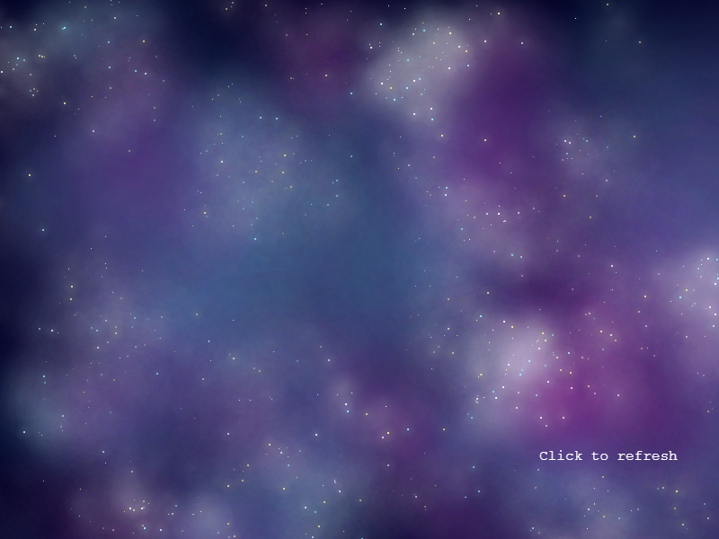
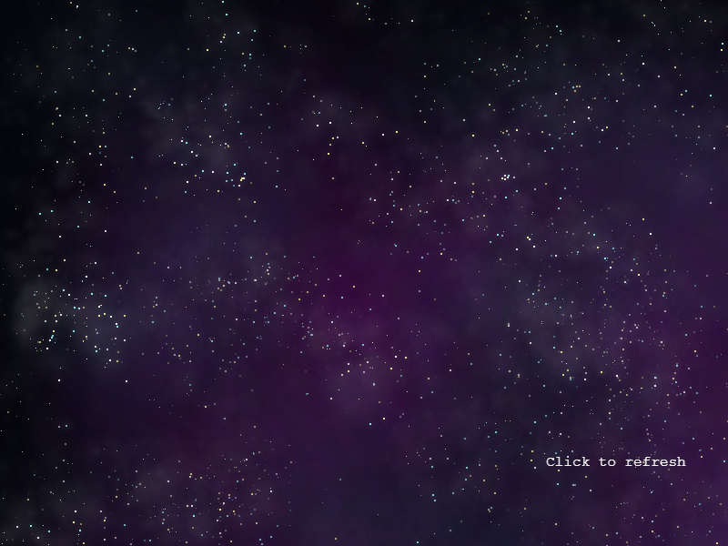

# SkyGenerator V2
Custom image class to use with the game framework [Phaser 3](https://phaser.io/).  
This class generates customizable star backgrounds.  
You can see the source in **dist** folder. 
Demo [here](https://jjcapellan.github.io/skygenerator2/).  
  
 
 
  
## Installation
There are two alternatives:
* Download the file [skygenerator.min.js](https://cdn.jsdelivr.net/gh/jjcapellan/skygenerator@2.0.0/dist/skygenerator.min.js) or [skygenerator.js](https://cdn.jsdelivr.net/gh/jjcapellan/skygenerator@2.0.0/dist/skygenerator.js) to your proyect folder and add a reference in your html:
```html
<script src = "skygenerator.min.js"></script>
```
* Point a script tag to the CDN link:
```html
<script src = "https://cdn.jsdelivr.net/gh/jjcapellan/skygenerator@2.0.0/dist/skygenerator.min.js"></script>
```   

## How to use
In the create method of a Phaser scene:
```js
this.add.existing(
      new SkyGenerator(
          this,                    // Phaser.Scene object
          800,                     // width in pixels
          600,                     // height in pixels
          {                        // optional config object
            starRadius: 4,
            cloud1Color: 0x80ffe6
          )
    );
```
The config object has this optional properties:
* [backgroundColor = 0x000023]
* [cloud1Opacity = 0.525] Opacity of first clouds layer [0.0 - 1.0]
* [cloud2Opacity = 0.865] Opacity of second clouds layer [0.0 - 1.0]
* [cloudStarAlpha = 0.5] Opacity of the star clouds [0.0 - 1.0]
* [cloudStarScale = 0.2] Scale of the star cloud [0.0 - 1.0]
* [gridUnitSize = 82] Size of the cells of the grid
* [maxStarsCluster = 46] Max stars in a cluster
* [minStarsCluster = 19] Min stars in cluster
* [starHightPassFilter = 0.3] Minimum value of the hightmap to generate a star cluster [0.1 - 0.9]
* [cloudRadius = 200] Radius of the generated clouds
* [cloudGradient = 1] Gradient of transparency of the cloud. (0.0 - 1.0)
* [starRadius = 48] Maximum radius of the stars.
* [starAlpha = 0.9] Maximum opacity of the stars.
* [starHardness = 0.03] Opaque proportion of the radius star. (0.0 - 1.0) 
* [starGradient = 0.54] Gradient of transparency of the star. (0.0 - 1.0)
* [starsDispersion = 1] Dispersion of the stars (1 = no dispersion) 
* [starColors = [0xfcf9a7, 0xffffff, 0x9ef7fc]] Array of colors to apply to the stars.
* [cloud1Color = 0x65ddf7] Color of the first layer of clouds.
* [cloud2Color = 0x830e81] Color of the second layer of clouds.
* [scaleStar2 = 0.8] Scale of the second star type.
* [scaleStar3 = 0.4] Scale of third star type.

## Dependencies
* [Phaser 3](https://phaser.io/): a great javascript game framework.
* [simplex-noise](https://github.com/jwagner/simplex-noise.js): a fast simplex noise implementation in Javascript.

## Other libraries used in the demo
* [dat.gui](https://github.com/dataarts/dat.gui): Lightweight library with which I have made the GUI of the demo.