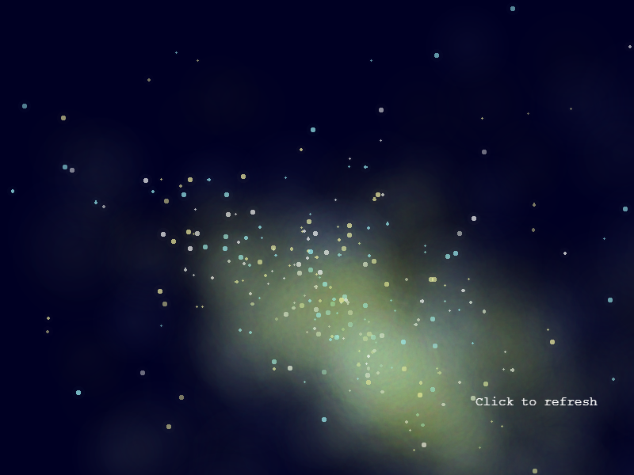
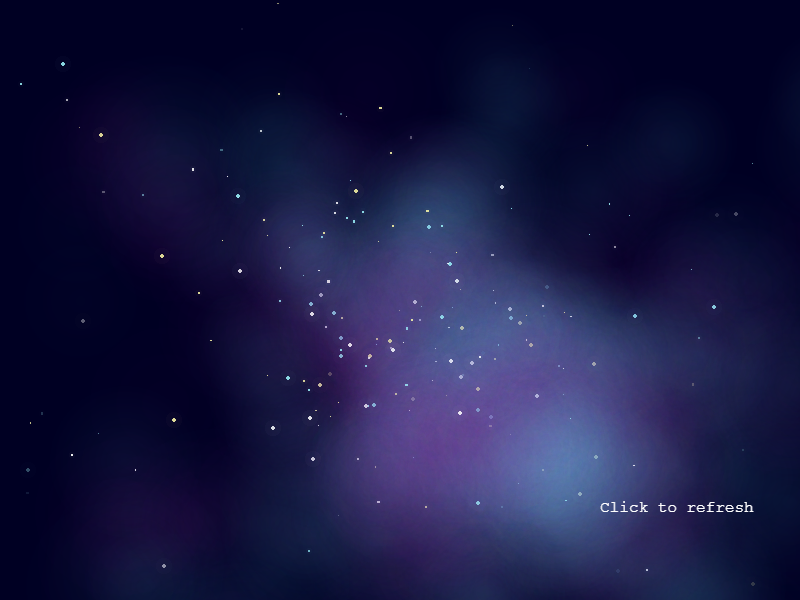

# SkyGenerator
Custom image class to use with the game framework [Phaser 3](https://phaser.io/).  
This class generates customizable star backgrounds.  
Demo [here](https://jjcapellan.github.io/skygenerator/).  
  
 
  
## Installation
There are two alternatives:
* Download the file [skygenerator.min.js](https://cdn.jsdelivr.net/gh/jjcapellan/skygenerator@1.0.0/dist/skygenerator.min.js) to your proyect folder and add a reference in your html:
```html
<script src = "skygenerator.min.js"></script>
```
* Point a script tag to the CDN link:
```html
<script src = "https://cdn.jsdelivr.net/gh/jjcapellan/skygenerator@1.0.0/dist/skygenerator.min.js"></script>
```   

## How to use
In the create method of a Phaser scene:
```js
this.add.existing(
      new SkyGenerator(
          this,                    // Phaser.Scene object
          800,                     // width in pixels
          600,                     // height in pixels
          {                        // optional config object
            starRadius: 4,
            cloud1Color: 0x80ffe6
          )
    );
```
The config object has this optional properties:
* [backgroundColor = 0x000023]
* [globalOpacity = 0.5] Number between 0 and 1.
* [initialPointsQty = 50] Initial number of points.
* [generatedPointsQty = 140] Number of points generated using the initial points.
* [margin = 0] Margin in pixels for the generation zone.
* [cloudRadius = 100] Radius of the generated clouds.
* [starHaloRadius = 8] Radius of the stars halo. Must be grater than the radius of the star.
* [starRadius = 3] Maximum radius of the stars.
* [starAlpha = 0.9] Maximum opacity of the stars.
* [haloAlpha = 0.02] Maximum opacity of the halos.
* [starColors = [0xfcf9a7, 0xffffff, 0x9ef7fc]] Array of colors to apply to the stars.
* [cloud1Color = 0x65ddf7] Color of the first layer of clouds.
* [cloud2Color = 0x830e81] Color of the second layer of clouds.
* [scaleStar2 = 0.8] Scale of the second star type.
* [scaleStar3 = 0.4] Scale of third star type.

## Libraries and frameworks used
* [Phaser 3](https://phaser.io/): a great javascript game framework.
* [dat.gui](https://github.com/dataarts/dat.gui): Lightweight library with which I have made the GUI of the demo.